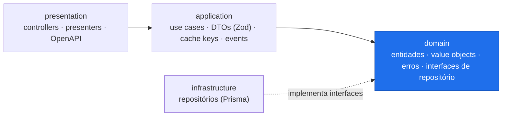
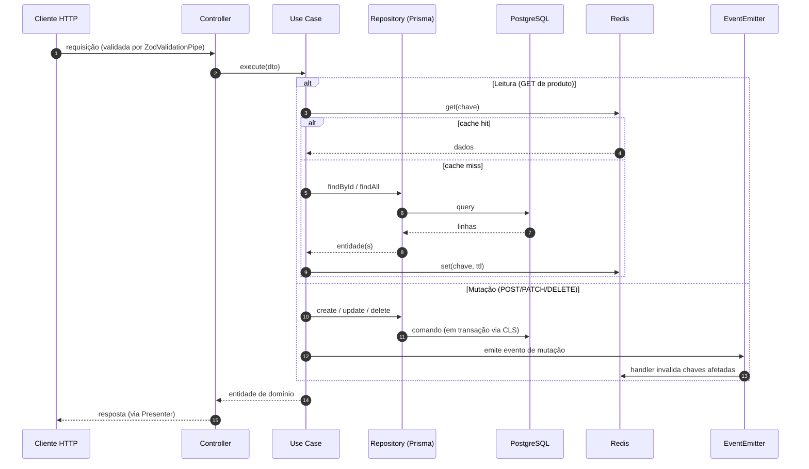
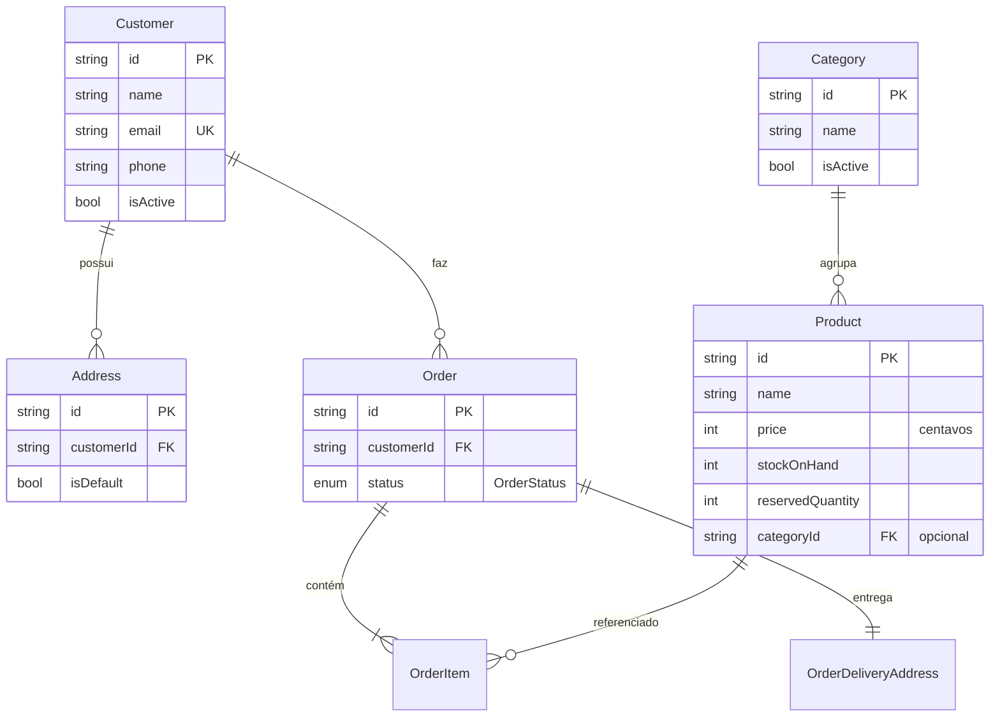

# Order Flow

API REST de e-commerce para gestão de clientes, produtos e pedidos — construída com **Clean Architecture** modular em NestJS, com foco em **domínio testável e isolado de frameworks e infraestrutura**.

[](https://nestjs.com/)
[](https://www.typescriptlang.org/)
[](https://www.prisma.io/)
[](https://www.postgresql.org/)
[](https://redis.io/)
[](https://jestjs.io/)

## Visão geral

Backend que expõe recursos versionados em `/api/v1`, documentados via Swagger em `/api/docs`.

O código é organizado em camadas (Clean Architecture): a **regra de negócio fica isolada** de frameworks e banco de dados. Na prática, isso significa que trocar Prisma por outro ORM, ou Redis por outro cache, não toca o núcleo do domínio.

**Funcionalidades atuais:**

- CRUD de **clientes** com validação de e-mail e telefone (`libphonenumber-js`)
- **Endereços** por cliente (criar, atualizar, remover, definir padrão)
- CRUD de **produtos** com controle de preço, estoque e quantidade reservada, e associação a **categoria** (validada na escrita e embutida no retorno)
- CRUD de **categorias** com proteção de integridade (remoção bloqueada se houver produtos vinculados; desativação é livre)
- **Pedidos** com múltiplos itens, endereço de entrega (snapshot do endereço do cliente) e numeração sequencial (`SEQUENCE` no banco). A criação **reserva estoque** dos produtos numa transação; a **máquina de estados** (`PENDING → PROCESSING → SHIPPED → DELIVERED`, e `CANCELLED`) baixa o estoque no envio e o cancelamento libera a reserva. **Controle de concorrência** com lock pessimista evita *oversell* em pedidos simultâneos
- **Cache Redis** em leitura de produtos e pedidos, com invalidação automática por eventos
- **Health checks** (liveness e readiness com checagem do banco)

## Stack

| Camada | Tecnologia |
|--------|------------|
| Framework | NestJS 11 (TypeScript, CommonJS) |
| Banco / ORM | PostgreSQL 16 + Prisma 7 |
| Cache | Redis 7 (`ioredis`) |
| Validação | Zod (pipe por endpoint) |
| Logs | Pino (logs estruturados) |
| Docs | Swagger / OpenAPI |
| Segurança HTTP | Helmet, CORS, rate limit (`@nestjs/throttler`) |
| Transações | `nestjs-cls` + adapter Prisma |
| Testes | Jest 30 + Supertest (e2e) |

## Arquitetura

Cada módulo de negócio segue a mesma separação por responsabilidade, e **a dependência só aponta para dentro**: as camadas externas conhecem o domínio, nunca o contrário.



**Regra de ouro:** `domain` não conhece nenhuma outra camada. Infraestrutura e apresentação dependem do domínio através de interfaces — a infra *implementa* contratos definidos no domínio (inversão de dependência).

Fluxo de uma requisição — leitura usa cache; mutação dispara invalidação por evento:



Estrutura de pastas:

```
order-flow/
├── prisma/                # schema e migrations
└── src/
    ├── common/            # pipes, filters, interceptors (cross-cutting HTTP)
    ├── core/              # prisma, cache, health, transações
    ├── shared/            # bootstrap, logger, tipos
    └── modules/
        ├── customer/      # ✅ implementado
        ├── product/       # ✅ implementado (+ cache)
        └── order/         # ✅ implementado (+ cache, reserva de estoque, concorrência)
```

## Destaques técnicos

Pontos onde o projeto vai além do CRUD básico:

- **Value objects ricos** — regras de negócio encapsuladas em tipos imutáveis, não espalhadas em services:
  - `Money` guarda valor em centavos (inteiro) e expõe operações seguras, eliminando erro de ponto flutuante.
  - `Email` normaliza e valida, expondo `local`/`domain`.
  - `Phone` usa `libphonenumber-js` (parsing E.164, formatação nacional/internacional, DDD) e aplica a **regra da Anatel de 2014**: número móvel brasileiro (11 dígitos nacionais) precisa ter `9` como primeiro dígito após o DDD — caso contrário é rejeitado.
- **Transações sem acoplamento** — use cases anotados com `@Transactional()`; o contexto transacional é propagado por `nestjs-cls` + `TransactionalAdapterPrisma`. O domínio não conhece `PrismaService` nem repassa o client transacional manualmente (sem *prop drilling*).
- **Concorrência de estoque** — criar pedido e mudar status reservam/baixam estoque sob **lock pessimista** (`SELECT … FOR UPDATE`, ordenado por id para evitar deadlock) dentro da transação, impedindo *oversell* quando vários pedidos disputam o mesmo produto. O invariante continua no domínio (`Product.reserve/fulfill/release`); o lock é detalhe de persistência. A numeração de pedido usa `SEQUENCE` (atômica), e um `CHECK` no banco (`reservedQuantity ≤ stockOnHand`) é rede de segurança.
- **Rastreabilidade de requisições** — `RequestIdMiddleware` gera/propaga `X-Request-Id`; o `LoggingInterceptor` registra `method`, `path`, `statusCode`, `durationMs` e `correlationId` em logs estruturados (Pino), correlacionando toda a requisição.
- **Prisma com driver adapter PG** (`@prisma/adapter-pg`) — conexão via adapter (edge-ready), com ciclo de vida controlado em `onModuleInit`/`onModuleDestroy`.
- **Rate limit seletivo** — `@nestjs/throttler` global (100 req/min por IP) aplicado como guard, com `@SkipThrottle()` nos health checks para não interferir em sondas de orquestrador.
- **Tratamento de erros centralizado** — exceções de domínio estendem `DomainError` e são lançadas no núcleo; um filtro global traduz cada uma para o status HTTP correto, mantendo as camadas internas livres de HTTP.

## Modelo de dados



| Entidade | Descrição |
|----------|-----------|
| **Customer** | nome, e-mail único, telefone, `isActive` |
| **Address** | vinculado ao cliente, `isDefault`, remoção em cascata |
| **Product** | nome, descrição, `price` (centavos), `stockOnHand`, `reservedQuantity`, `categoryId` (opcional) |
| **Category** | nome, `isActive`, relação opcional com `Product` |
| **Order** | número sequencial único, cliente, `status` (`OrderStatus`), itens e endereço de entrega; remoção dos filhos em cascata |
| **OrderItem** | snapshot de `productName` + `price` (centavos) + `quantity` no momento do pedido |
| **OrderDeliveryAddress** | snapshot imutável do endereço escolhido para entrega |

## Como rodar

**Pré-requisitos:** Node.js 20+, npm e Docker.

```bash
# 1. Sobe PostgreSQL (5432) e Redis (6379)
docker compose up -d

# 2. Variáveis de ambiente
cp .env.example .env

# 3. Dependências, client Prisma e migrations
npm install
npm run prisma:generate
npm run prisma:migrate

# 4. Sobe a API (porta 3000 por padrão)
npm run start:dev
```

Endpoints úteis após subir:

| Recurso | URL |
|---------|-----|
| Swagger UI | http://localhost:3000/api/docs |
| Liveness | http://localhost:3000/health |
| Readiness (banco) | http://localhost:3000/health/ready |

> A API fica sob o prefixo `/api/v1`; `health` e `docs` ficam fora dele.

## Endpoints

**Categorias** — `/api/v1/categories`

| Método | Rota | Descrição |
|--------|------|-----------|
| POST | `/` | Criar categoria |
| GET | `/` | Listar (paginação, filtro por nome parcial) |
| GET | `/:id` | Buscar por ID |
| PATCH | `/:id` | Atualizar nome |
| PATCH | `/:id/deactivate` | Desativar (permitido mesmo com produtos vinculados) |
| DELETE | `/:id` | Remover (bloqueado se houver produtos vinculados) |

**Produtos** — `/api/v1/products`

| Método | Rota | Descrição |
|--------|------|-----------|
| POST | `/` | Criar produto |
| GET | `/` | Listar (paginação, filtros, ordenação — *com cache*) |
| GET | `/:id` | Buscar por ID (*com cache*) |
| PATCH | `/:id` | Atualizar dados gerais |
| PATCH | `/:id/price` | Atualizar preço |
| PATCH | `/:id/amount` | Atualizar estoque |
| DELETE | `/:id` | Remover |

**Clientes** — `/api/v1/customers`

| Método | Rota | Descrição |
|--------|------|-----------|
| POST | `/` | Criar cliente |
| GET | `/` · `/:id` | Listar (paginado) · buscar por ID |
| PATCH | `/:id` | Atualizar |
| DELETE | `/:id` | Remover |
| POST | `/:customerId/addresses` | Criar endereço |
| PATCH | `/:customerId/addresses/:addressId` | Atualizar endereço |
| PATCH | `/:customerId/addresses/:addressId/default` | Definir como padrão |
| DELETE | `/:customerId/addresses/:addressId` | Remover endereço |

**Pedidos** — `/api/v1/orders`

| Método | Rota | Descrição |
|--------|------|-----------|
| POST | `/` | Criar pedido (valida cliente/endereço/produtos, reserva estoque) |
| GET | `/` | Listar (paginação, filtros por status e cliente, ordenação — *com cache*) |
| GET | `/:id` | Buscar por ID com itens e endereço (*com cache*) |
| PATCH | `/:id/status` | Mudar status (máquina de estados; baixa/libera estoque) |
| POST | `/:id/cancel` | Cancelar (libera a reserva de estoque) |

Payloads e respostas completos no Swagger.

## Variáveis de ambiente

| Variável | Descrição | Padrão |
|----------|-----------|--------|
| `PORT` | Porta HTTP | `3000` |
| `DATABASE_URL` | Connection string PostgreSQL | — |
| `REDIS_URL` | URL do Redis | — |
| `PRODUCT_CACHE_TTL_MS` | TTL do cache de produto | `300000` (5 min) |
| `PRODUCT_LIST_CACHE_TTL_MS` | TTL do cache de listagem de produtos | `120000` (2 min) |
| `ORDER_CACHE_TTL_MS` | TTL do cache de pedido | `300000` (5 min) |
| `ORDER_LIST_CACHE_TTL_MS` | TTL do cache de listagem de pedidos | `120000` (2 min) |
| `LOG_LEVEL` | Nível de log (Pino) | `info` |
| `CORS_ORIGIN` | Origens permitidas (separadas por vírgula) | todas em dev |

## Testes

```bash
npm run test       # unitários
npm run test:e2e   # end-to-end (health, products, categories, orders)
npm run test:cov   # cobertura
```

**277 testes unitários + 38 e2e.** O isolamento de camadas é o que torna isso viável: os use cases são testados contra **repositórios in-memory** (implementações das mesmas interfaces de domínio), sem subir banco — testes rápidos e determinísticos. A cobertura inclui value objects (`Money`, `Email`, `Phone`, `OrderNumber`), entidades (incluindo a máquina de estados de `Order`), DTOs Zod e use cases de `customer`, `product` e `order`, além do filtro de exceções e do pipe de validação em `common`. Os e2e exercitam a stack HTTP real com Supertest.

> A corrida de estoque (oversell) não é coberta por teste automatizado — o harness e2e usa repositórios in-memory (single-thread). A trava é uma asserção de ordem (lock adquirido antes da escrita) e a validação foi feita manualmente contra o Postgres: N pedidos simultâneos para um produto escasso resultam em exatamente `stockOnHand` criados e o restante recusado com `422`, sem oversell.

Antes de concluir uma mudança: `npm run typecheck && npm test`.

## Decisões técnicas

Cada decisão abaixo resolve um problema concreto — e tem um custo assumido conscientemente:

- **Camadas isoladas por módulo** — a regra de negócio não depende de NestJS nem Prisma, o que dá testes rápidos (in-memory) e liberdade para trocar infraestrutura. **Custo:** mais boilerplate — interfaces de repositório e mapeadores `toDomain`. **Descartado:** services anêmicos acoplados ao ORM, que misturam persistência e regra.

- **Use cases explícitos** — cada operação é uma classe com um `execute()`; controllers ficam finos (validam e respondem) e a intenção de cada fluxo fica óbvia. **Custo:** muitas classes pequenas. **Benefício:** baixo acoplamento e fácil teste unitário por caso de uso.

- **Zod nos DTOs** — validação declarativa que vira tipo TypeScript via `z.infer`: uma única fonte de verdade para "o que é um payload válido". **Descartado:** `class-validator` + `class-transformer`, que duplicam a forma entre classe e decorators e dependem de metadados.

- **Dinheiro em centavos (`Int`)** — preço nunca é float; o value object `Money` encapsula as operações e elimina erro de arredondamento. **Custo:** conversão float↔centavos nas bordas (entrada da API e Presenter), centralizada no próprio `Money`.

- **Cache com invalidação por eventos** — leituras de produto vêm do Redis; toda mutação emite um evento de domínio que limpa as chaves afetadas. Leitura rápida *sem* servir dado obsoleto. **Descartado:** TTL puro, que serviria dados desatualizados na janela do TTL. **Custo:** acoplamento indireto via eventos.

- **Transações via CLS** — `@Transactional()` propaga o contexto pelo `AsyncLocalStorage`, sem repassar o client transacional caso a caso. **Custo:** dependência do CLS/AsyncLocalStorage. **Benefício:** use cases legíveis, sem *prop drilling* do Prisma.

- **Concorrência por lock pessimista** — reserva e baixa de estoque usam `SELECT … FOR UPDATE` (ordenado por id) dentro da transação, serializando apenas quem disputa o mesmo produto e mantendo a regra de estoque no domínio. **Descartado:** `UPDATE` condicional atômico (moveria o invariante para o SQL) e `Serializable` + retry (exigiria camada de retry/idempotência, e re-tentar a criação reconsumiria a numeração). **Custo:** contenção em produtos muito disputados — aceitável para o domínio de pedidos.

- **Erros de domínio** — exceções estendem `DomainError` e são lançadas no núcleo; um filtro global as traduz para o status HTTP correto. As camadas internas nunca conhecem HTTP.

- **Observabilidade e endurecimento** — logs estruturados (Pino) com `correlationId` por requisição, Helmet, CORS configurável e rate limit global (com health checks isentos).

## Roadmap

- ✅ **Order Service** — `OrderModule` (use cases, repositórios, rotas) com reserva de estoque, máquina de estados e controle de concorrência
- 🚧 **Autenticação e autorização**
- 🚧 **CI/CD** — pipelines de build, teste e deploy

## Licença

Projeto privado (UNLICENSED).