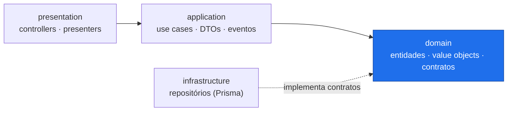
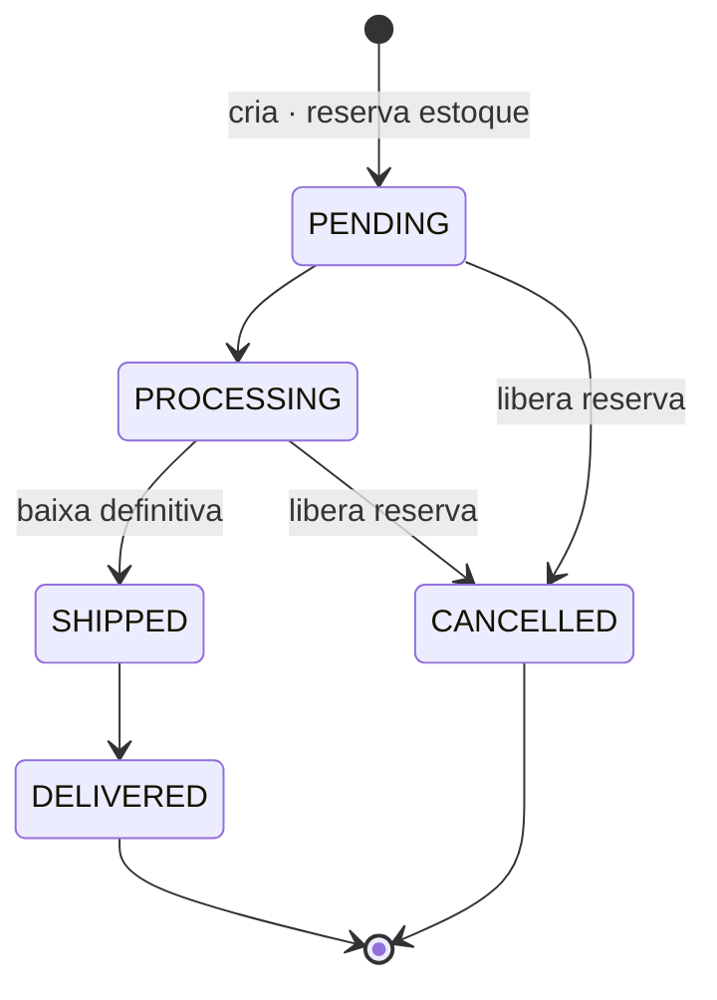

# Order Flow

API REST de e-commerce para clientes, produtos e pedidos, construída em **NestJS** com **Clean Architecture** — o domínio de negócio é isolado de frameworks, banco e cache, e coberto por testes rápidos e determinísticos.

[](https://nestjs.com/)
[](https://www.typescriptlang.org/)
[](https://www.prisma.io/)
[](https://www.postgresql.org/)
[](https://redis.io/)
[](https://jestjs.io/)

A API é versionada em `/api/v1` e documentada via **Swagger** em `/api/docs`.

## Capacidades

- **Clientes e endereços** — cadastro com validação de e-mail e telefone (E.164 via `libphonenumber-js`), múltiplos endereços e endereço padrão.
- **Catálogo** — produtos com preço, estoque e reserva, organizados em categorias com proteção de integridade referencial.
- **Pedidos** — criação com reserva de estoque transacional, ciclo de vida por máquina de estados e cancelamento com liberação de reserva. **Concorrência tratada** por lock pessimista — sem *oversell*.
- **Plataforma** — cache Redis com invalidação por eventos, logs estruturados correlacionados por requisição, rate limiting e health checks.

## Arquitetura

Arquitetura modular em camadas: cada módulo de negócio (`customer`, `product`, `order`) se divide em `domain`, `application`, `infrastructure` e `presentation`, e **a dependência só aponta para dentro**.



**Regra de ouro:** o `domain` não conhece NestJS, Prisma ou Redis. A infraestrutura *implementa* interfaces definidas no domínio — a inversão de dependência mantém a regra de negócio testável em isolamento e a infraestrutura substituível.

```
src/
├── common/    # pipes, filtros, interceptors (HTTP transversal)
├── core/      # Prisma, cache, health, transações
├── shared/    # bootstrap, logger, tipos
└── modules/   # customer · product · order
```

### Ciclo de vida do pedido

A máquina de estados vive no domínio; cada transição decide o efeito sobre o estoque.



## Destaques de engenharia

- **Domínio testável em isolamento** — use cases verificados contra repositórios in-memory (as mesmas interfaces de domínio), sem subir banco.
- **Dinheiro sem ponto flutuante** — o value object `Money` opera em centavos inteiros; a conversão acontece apenas nas bordas da API.
- **Concorrência de estoque** — reserva e baixa ocorrem sob `SELECT … FOR UPDATE` (ordenado, dentro da transação), impedindo *oversell* entre pedidos simultâneos. A numeração usa uma `SEQUENCE` atômica e há `CHECK` no banco como rede de segurança — o invariante de estoque permanece no domínio.
- **Transações declarativas** — `@Transactional()` propaga o contexto via `AsyncLocalStorage` (`nestjs-cls`), sem repassar o client Prisma manualmente.
- **Cache coerente** — leituras servidas pelo Redis; toda mutação emite um evento de domínio que invalida as chaves afetadas, evitando dado obsoleto.
- **Erros de domínio mapeados** — exceções estendem `DomainError` e um filtro global as traduz para o status HTTP correto; as camadas internas não conhecem HTTP.
- **Pronto para operar** — `X-Request-Id` propagado e correlacionado nos logs (Pino), Helmet, CORS configurável e rate limit (com health checks isentos).

## Stack

| Camada | Tecnologia |
|--------|------------|
| Framework | NestJS 11 (TypeScript, CommonJS) |
| Banco / ORM | PostgreSQL 16 + Prisma 7 (`@prisma/adapter-pg`) |
| Cache | Redis 7 (`ioredis`) |
| Validação | Zod |
| Transações | `nestjs-cls` + adapter Prisma |
| Observabilidade | Pino · Swagger / OpenAPI |
| Segurança HTTP | Helmet · CORS · `@nestjs/throttler` |
| Testes | Jest 30 · Supertest |

## Como rodar

**Pré-requisitos:** Node.js 20+, npm e Docker.

```bash
docker compose up -d            # PostgreSQL (5432) e Redis (6379)
cp .env.example .env            # configuração (veja o arquivo)
npm install
npm run prisma:generate
npm run prisma:migrate
npm run start:dev               # API em http://localhost:3000
```

| Recurso | URL |
|---------|-----|
| Swagger UI | `http://localhost:3000/api/docs` |
| Liveness · Readiness | `/health` · `/health/ready` |

A configuração fica em `.env` (conexões, TTLs de cache, log e CORS). A coleção `requests/order-flow.http` (REST Client) exercita o fluxo completo — clientes, produtos e pedidos em todos os status — de ponta a ponta.

## Testes

```bash
npm run test       # unitários
npm run test:e2e   # end-to-end (Supertest)
npm run test:cov   # cobertura
```

**277 testes unitários + 38 e2e.** A suíte cobre value objects, entidades (incluindo a máquina de estados do pedido), DTOs e use cases — estes contra repositórios in-memory —, além do tratamento de erros e validação. Os e2e exercitam a stack HTTP real.

> Antes de concluir uma mudança: `npm run typecheck && npm test`.

## Roadmap

- ✅ **Pedidos** — `OrderModule` com reserva de estoque, máquina de estados e controle de concorrência
- 🚧 **Autenticação e autorização**
- 🚧 **CI/CD** — build, teste e deploy automatizados

## Licença

Projeto privado (UNLICENSED).
